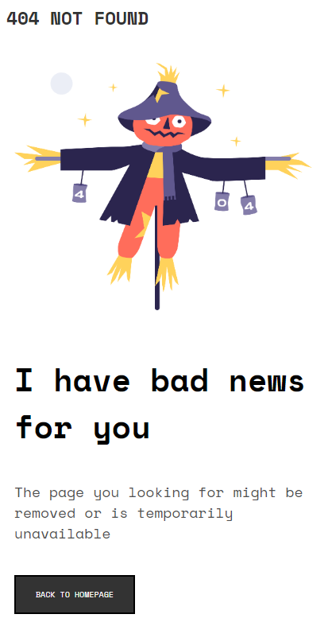
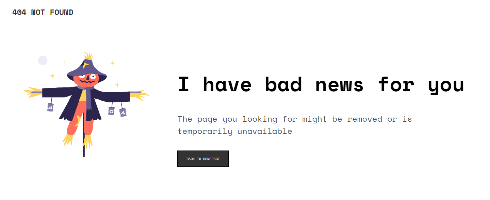

# Make It Real - 404 NOT FOUND PAGE

This is a solution to the 404 NOT FOUND PAGE project of the Make It Real course.

## Table of contents

- [Overview](#overview)
  - [The challenge](#the-challenge)
  - [Screenshot](#screenshot)
- [My process](#my-process)
  - [Built with](#built-with)
  - [What I learned](#what-i-learned)
  - [Continued development](#continued-development)
  - [Useful resources](#useful-resources)
- [Author](#author)
- [Acknowledgments](#acknowledgments)


## Overview

### The challenge

Users should be able to:

- Change the size of the site for desktop and mobile and see how it works properly in each size.

### Screenshot




## My process

### Built with

- Semantic HTML5 markup
- CSS custom properties
- Flexbox
- Mobile-first workflow

### What I learned

In this project we learn hoy to use medua queries and flexbox to desing a responsive mobile-first site.

```css
   @media screen and (min-width: 1440px) {
    body{
        margin: 20px 40px;
    }


    .container {
      display: flex;
      flex-direction: row;
      justify-content: center;
      padding: 100px 30px;
    }
```


### Continued development

We need to continue learning about how flexbox works and about responsive desing

### Useful resources

- [Resource 1](https://www.w3schools.com/css/css3_mediaqueries.asp) - This helped me to see the syntax of media queries.
- [Resource 2]([https://www.example.com](https://platzi.com/blog/flexbox-explicado-con-manzanitas/?utm_source=google&utm_medium=cpc&utm_campaign=17739691128&utm_adgroup=&utm_content=&gclid=CjwKCAjwqJSaBhBUEiwAg5W9p6VmJgCRt2q92c9ZP8YdFUVlTVBgXbzODawazBUG9S8lCL1OBbYdkRoCiKEQAvD_BwE&gclsrc=aw.ds)) - This is an amazing article which helped me to undestand Flexbox in an easy way.

## Author

- Juan Sebastián Muñoz


## Acknowledgments

Thanks to Laura, my partner in this project and the teacher Cristian Moreno.
